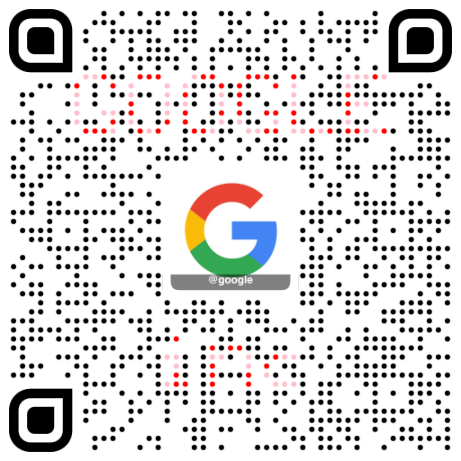

# qr-service

qr code generator service




## Run

```shell
npm i

npm run dev
```

GET `http://localhost:3000/qr?d=https://github.com/catcatio/qrservice`

POST `http://localhost:3000/qr`

```json
{
  "text": "https://www.google.com/search?ei=jf5rW6Nfl5H1A__rhMAN&q=google&oq=google",
  "logoUrl": "https://pbs.twimg.com/profile_images/972154872261853184/RnOg6UyU_400x400.jpg",
  "logoText": "@google",
  "maskTextLine1": "GOOGLE",
  "maskTextLine2": "inc"
}
```
